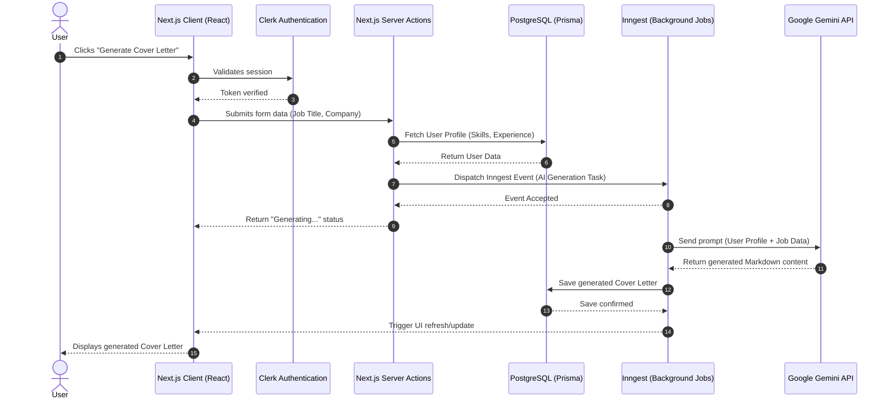
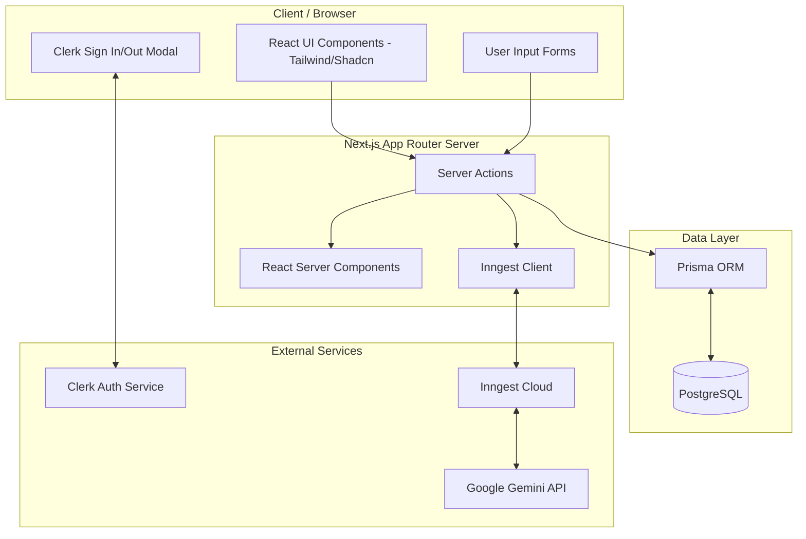
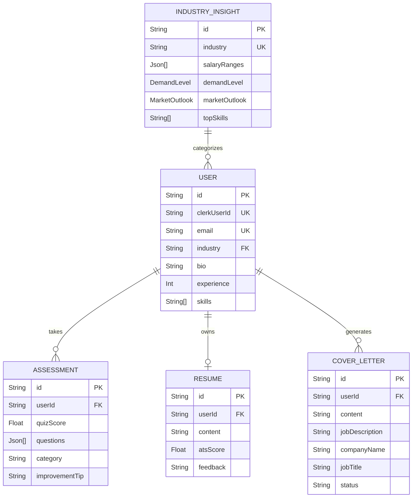
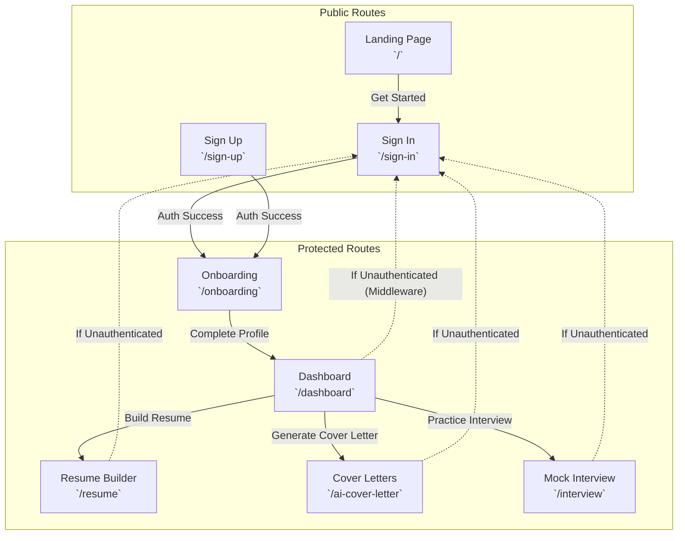

# Sensai: Project Architecture Diagrams

These diagrams map out the core interactions, system architecture, and use cases of the Sensai platform. They are formatted using Mermaid.js and will render automatically in any markdown viewer that supports Mermaid (like VSCode extensions or GitHub).

## 1. System Architecture & Data Flow (Sequence Diagram)
This diagram illustrates the flow of data when a user requests an AI-generated service (e.g., generating a cover letter or analyzing a resume).



## 2. Platform Use Cases (Use Case Diagram)
This diagram maps out what an authenticated user can do within the platform versus what the AI system handles.

```mermaid
usecaseDiagram
    actor "Registered User" as user
    actor "Gemini AI Engine" as ai
    actor "Clerk Auth" as auth

    rectangle Sensai Platform {
        usecase "Sign Up / Log In" as UC1
        usecase "Manage Career Profile" as UC2
        usecase "Upload Resume" as UC3
        usecase "Take Mock Interview" as UC4
        usecase "Generate Cover Letter" as UC5
        usecase "View Industry Insights" as UC6
        
        usecase "Analyze Resume & Score ATS" as AI1
        usecase "Generate Interview Questions" as AI2
        usecase "Evaluate Interview Answers" as AI3
        usecase "Draft Tailored Cover Letter" as AI4
    }

    user --> UC1
    user --> UC2
    user --> UC3
    user --> UC4
    user --> UC5
    user --> UC6

    UC1 .> auth : authenticates via

    UC3 .> AI1 : triggers
    AI1 --> ai
    
    UC4 .> AI2 : triggers
    AI2 --> ai
    UC4 .> AI3 : triggers
    AI3 --> ai

    UC5 .> AI4 : triggers
    AI4 --> ai
```

## 3. High-Level Component Architecture (Flowchart)
This flowchart shows the separation of concerns between the Client (Browser), the Edge/Server (Next.js), the Database, and External Services.



## 4. Entity Relationship Diagram (ERD)
*(Included here for completeness alongside the other diagrams)*



## 5. Navigation & Page Routing Flow
This flowchart maps out the user journey between the different routes (pages) in the Next.js application, including how the authentication middleware protects specific paths.


