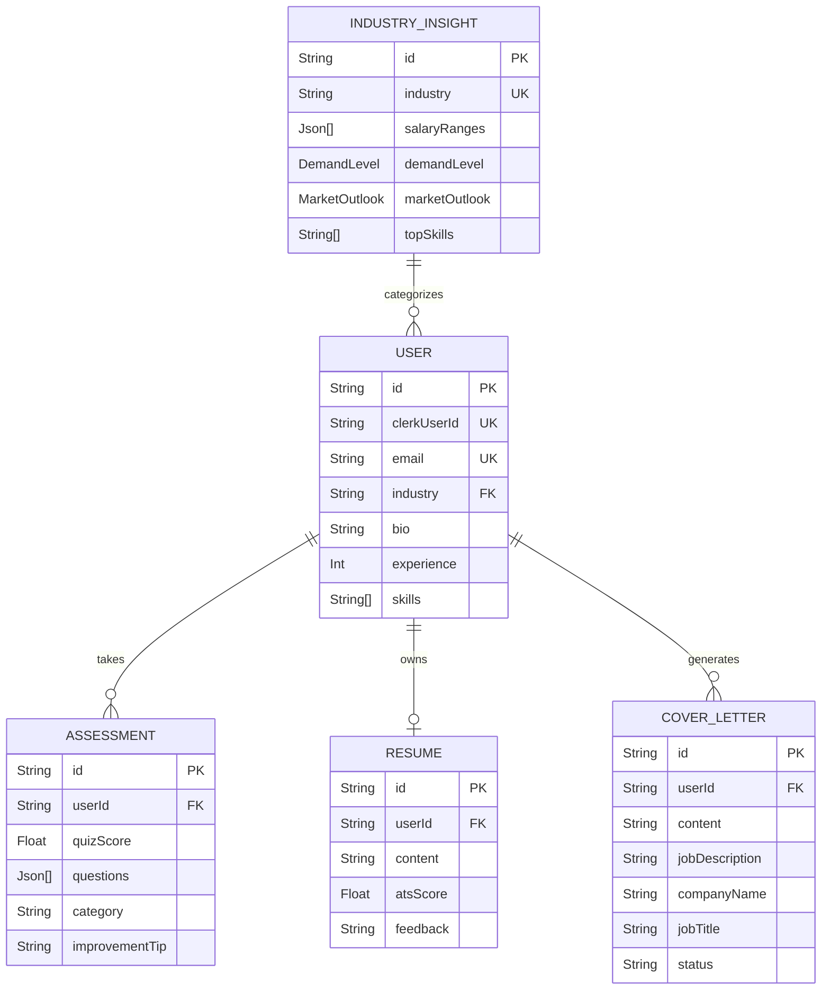

# Sensai: AI-Powered Career Assistant (Project Analysis Report)

## 1. Abstract
Sensai is a comprehensive, AI-driven career development platform designed to bridge the gap between job seekers and the evolving demands of the job market. Leveraging generative artificial intelligence, the platform provides personalized career guidance, automated resume optimization, AI-generated cover letters, and simulated technical assessments. The goal is to democratize access to high-quality career coaching through an intuitive, automated web application.

## 2. Problem Statement
Job seekers often struggle with:
1. Understanding exactly what Applicant Tracking Systems (ATS) look for in a resume.
2. Writing tailored cover letters for specific job descriptions, which is time-consuming.
3. Practicing for interviews effectively without a human counterpart.
4. Keeping up with rapidly changing industry trends and salary benchmarks.

**Sensai solves this** by acting as a 24/7 AI Career Coach that automates document generation, provides immediate feedback, and offers data-driven industry insights.

## 3. Technology Stack & Justification

| Technology | Role in Project | Justification |
| :--- | :--- | :--- |
| **Next.js 14+ (App Router)** | Frontend & Full-stack Framework | Provides Server-Side Rendering (SSR) for fast load times, excellent SEO, and seamless API route integration. |
| **PostgreSQL & Prisma ORM** | Relational Database & ORM | PostgreSQL ensures data integrity, while Prisma provides a type-safe database client that speeds up development. |
| **Clerk** | Authentication & Authorization | Secure, scalable user management that handles social logins and session management out-of-the-box. |
| **Google Gemini API** | Artificial Intelligence Engine | Powers the core features: generating cover letters, analyzing resumes, and creating mock interview questions. |
| **Inngest** | Background Jobs & Workflows | Manages complex, long-running AI tasks (like generating detailed resume feedback) asynchronously without blocking the main server thread. |
| **Tailwind CSS & Shadcn UI** | Styling & UI Components | Enables rapid UI development with a premium, accessible, and responsive design system (featuring a modern dark theme and glassmorphism). |

## 4. Core Modules & Functionality

### A. Authentication & User Profiling
Users sign up via Clerk. Upon onboarding, the system captures their target industry, experience level, and core skills, which are saved in the PostgreSQL database to personalize all future AI interactions.

### B. Smart Resume Analyzer (ATS Optimization)
Users input their markdown resume. The system uses the Gemini API to analyze the content against industry standards, returning an **ATS Score** and actionable **Feedback** on how to improve formatting, keywords, and impact.

### C. AI Cover Letter Generator
Users provide a job description, company name, and job title. The Gemini API cross-references this with the user's saved profile to generate a highly tailored, professional cover letter in seconds.

### D. Mock Assessment System
The platform generates dynamic, role-specific interview questions. Once the user answers, the AI evaluates the response, assigns a **Quiz Score**, and provides specific **Improvement Tips**.

### E. Industry Insights
The system aggregates data to provide users with localized market intelligence, including salary ranges, demand levels, top skills, and market outlooks for their specific industry.

## 5. Database Architecture (Entity Relationship Diagram)

## 6. System Architecture & Data Flow
1. **Client Request:** The user triggers an action (e.g., "Generate Cover Letter") via the React frontend.
2. **Server Action:** Next.js intercepts the request securely on the server side.
3. **Background Processing:** For heavy AI tasks, Next.js triggers an **Inngest** event.
4. **AI Processing:** Inngest communicates with the **Gemini API** to process the prompt and return the generated text.
5. **Data Persistence:** The result is saved to **PostgreSQL** via **Prisma**.
6. **Client Update:** The UI updates dynamically to show the newly generated content to the user.

## 7. Future Scope
* **Real-time Voice Interviews:** Integrating speech-to-text to simulate actual phone/video interviews.
* **LinkedIn Integration:** Allowing users to import their profile data directly from LinkedIn via OAuth.
* **Job Board Scraping:** Automatically matching the user's AI-optimized resume with active job postings on the web.
